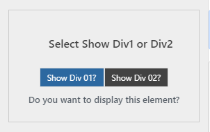
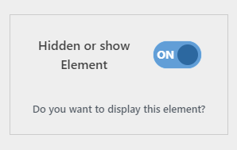
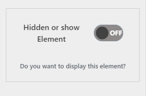

# Customizer Custom Controls #

**Author:** Cris Rocha 

<<<<<<< HEAD
**Author URI:** https://ocodigocris/
=======
**Author URI:** https://ocodigocris.com/
>>>>>>> a010c56a8ee906b8cb0dd4e09e8acc7b1bb83e9c

**Version:** 1.0

**License:**  GNU General Public License v2 or later 

**License  URI:** http://www.gnu.org/licenses/gpl-2.0.html 

## Description ##

Under development -

## Links ##

[O código Cris ](https://ocodigocris.com)  

# Get Started

<<<<<<< HEAD
# Get Started #
=======
1. Weit
1. Wheit
1. Wait
>>>>>>> a010c56a8ee906b8cb0dd4e09e8acc7b1bb83e9c

Under development -
# Custom Controls #

1. **Select Radio Controls**
1. **Checkbox ONN | OFF Control**

<<<<<<< HEAD
# Exemples #

### **Custom Select Radio Control**



=======
### Custom Select Radio Control


**Control**


```php
>>>>>>> a010c56a8ee906b8cb0dd4e09e8acc7b1bb83e9c


**Control**
```php
$wp_customize->add_setting( 'occ_custom_select_radio_control',
    array(
        'default'           => 'div1',
        'transport'         => 'refresh',
        'sanitize_callback' => 'occ_theme_sanitize_select_radio'
    )
);
$wp_customize->add_control( new WP_Customize_Select_Radio_Control( 
    $wp_customize, 
    'occ_custom_select_radio_control', 
    array(
        'label'     => __( 'Select Show Div1 or Div2', 'occ-theme' ),
        'section'   => 'occ_custom_section',
        'settings'  => 'occ_custom_select_radio_control',
        'choices'   => array(
            'div1'  => esc_html__('Show Div 01?','occ-theme'),
            'div2'  => esc_html__('Show Div 02?','occ-theme')           
        )
    ) 
));
<<<<<<< HEAD
```

**Sanitize Callback**
=======

```

**Sanitize Callback**

```php
>>>>>>> a010c56a8ee906b8cb0dd4e09e8acc7b1bb83e9c

```php
//Sanitize Callback Select Radio
function occ_theme_sanitize_select_radio( $value ){
    
    return ( $value );
}
<<<<<<< HEAD
=======

>>>>>>> a010c56a8ee906b8cb0dd4e09e8acc7b1bb83e9c
```

**Create WP_Custom_Control for Select Radio**

```php
<<<<<<< HEAD
=======

>>>>>>> a010c56a8ee906b8cb0dd4e09e8acc7b1bb83e9c
class WP_Customize_Select_Radio_Control extends WP_Customize_Control {
        public $type = 'select';
 
        public function render_content() {
        ?>
             <label id="occ_customizer_label"><?php echo esc_html( $this->label ); ?></label>
            <div id="wp_customize_select_radio">
                <?php foreach ( $this->choices as $value => $label ) : ?>
                    <span>
                        <input
                            id="<?php echo esc_attr( 'radio-' . $value ); ?>"
                            type="radio"
                            value="<?php echo esc_attr( $value ); ?>"
                            name="<?php echo esc_attr( $this->id ); ?>"
                            <?php $this->link(); ?>
                            <?php checked( $this->value(), $value ); ?>
                            />
                        <label for="<?php echo esc_attr( 'radio-' . $value ); ?>"><?php echo esc_html( $label ); ?></label>
                    </span>
                <?php endforeach; ?>  
            </div>
        <?php
        }
    }
<<<<<<< HEAD
```
### **Custom Checkbox ON | OFF Control**




**Control**

```php
$wp_customize->add_setting( 'occ_custom_checkbox_control',
    array(
        'transport'         => 'refresh',
        'sanitize_callback' => 'occ_theme_sanitize_checkbox'
    )
);
$wp_customize->add_control( new WP_Customize_Checkbox_Control( 
    $wp_customize, 
    'occ_custom_checkbox_control', 
    array(
        'label'         => __( 'Hidden or show Element', 'occ-theme' ),
        'section'       => 'occ_custom_section',
        'settings'      => 'occ_custom_checkbox_control',
        'type'          => 'checkbox',
        'description'   => 'Do you want to display this element?',
    ) 
));
```

**Sanitize Callback**

```php
//checkbox sanitization function
function occ_theme_sanitize_checkbox( $input ){
      
    //returns true if checkbox is checked
    return ( ( isset( $input ) && true == $input ) ? true : false );
}
```

**Create WP_Custom_Control for Checkbox**

```php
class WP_Customize_Checkbox_Control extends WP_Customize_Control {
        public $type = 'checkbox';
        public function render_content() {
        ?>
        
        <div id="occ_customize_checkbox" class="customizer_control_item">
            <p id="occ_customize_checkbox_label"><?php echo esc_html( $this->label ); ?></p>
            <label id="wp_customize_checkbox">
                    <input
                        id="<?php echo esc_attr( $this->id ); ?>"
                        type="checkbox"
                        value="<?php echo esc_attr( $this->id ); ?>"
                        <?php $this->link(); ?>
                        <?php checked( $this->id ); ?>
                    />
                    <span for="<?php echo esc_attr( $this->id ); ?>" id="occ_checkbox_control_span"></span>
            </label>
            <p id="occ_customize_checkbox_description"><?php  echo esc_html( $this->description ); ?></p>
        </div>
            
        <?php
        }
    }
=======
    
>>>>>>> a010c56a8ee906b8cb0dd4e09e8acc7b1bb83e9c
```

Under development -

### Usage ###
 

Under development -


Under development 

# occ-wp-customizer-custom-control
